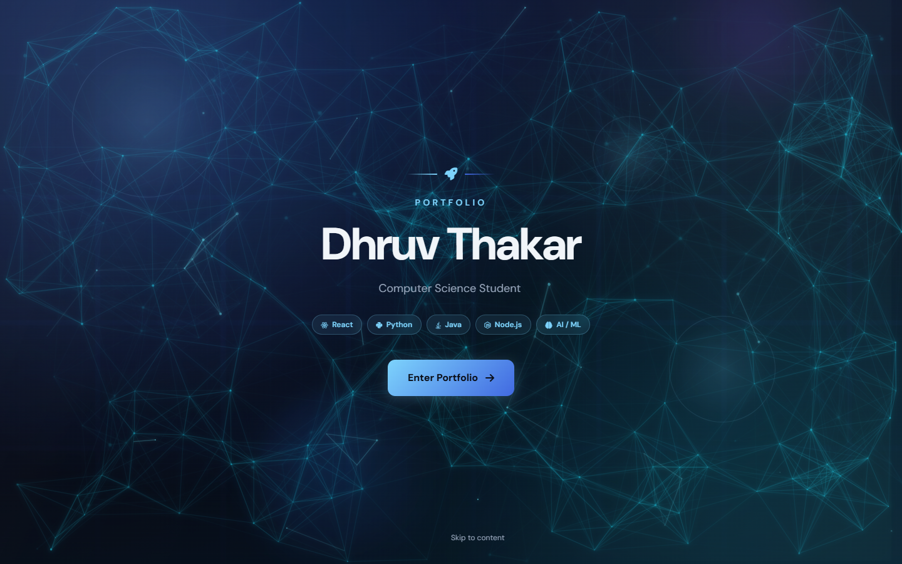
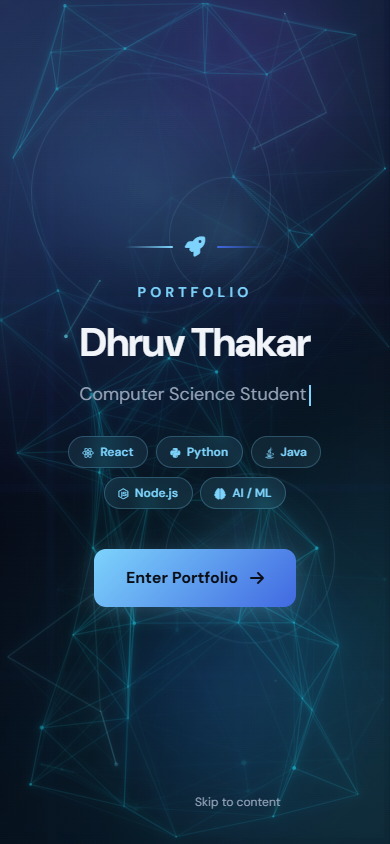
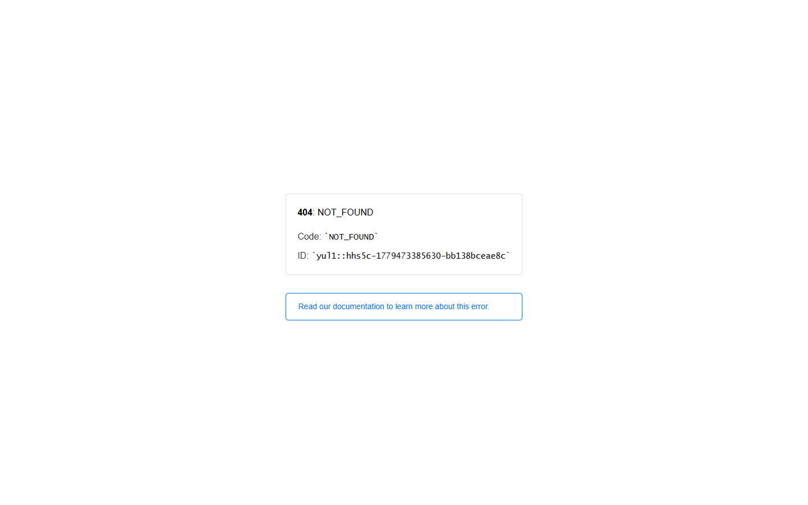
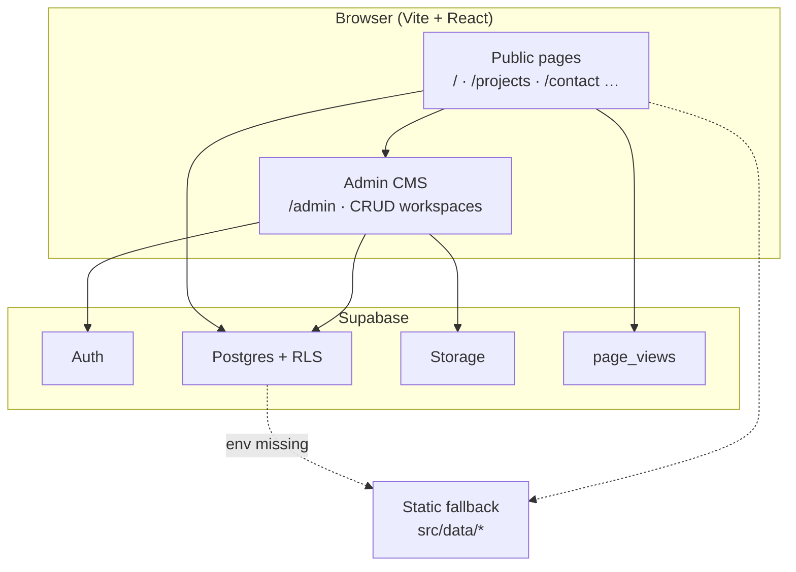

<div align="center">

# Dhruv Thakar — Portfolio & Admin CMS

**A production-ready personal portfolio with a Supabase-backed admin portal, animated public pages, and reusable UI patterns.**

[](https://www.thakardhruv.me/)
[](https://github.com/dhruvht612/My_Portfolio)
[](https://github.com/dhruvht612/My_Portfolio/stargazers)
[](https://github.com/dhruvht612/My_Portfolio/forks)
[](https://react.dev/)
[](https://vite.dev/)
[](https://supabase.com/)
[](https://tailwindcss.com/)

**Live site:** [https://www.thakardhruv.me/](https://www.thakardhruv.me/)

</div>

---

## Table of contents

- [Screenshots](#screenshots)
- [Why I built this](#why-i-built-this)
- [Overview](#overview)
- [Live demo & routes](#live-demo--routes)
- [Featured projects](#featured-projects)
- [UI & UX](#ui--ux)
- [Tech stack](#tech-stack)
- [Architecture](#architecture)
- [Roadmap](#roadmap)
- [Reusable building blocks](#reusable-building-blocks)
- [Open-source value](#open-source-value)
- [Contributing](#contributing)
- [GitHub profile](#github-profile)
- [Quick start](#quick-start)
- [Environment variables](#environment-variables)
- [Scripts](#scripts)
- [Project structure](#project-structure)
- [Recent commits](#recent-commits)
- [Documentation](#documentation)
- [Deployment](#deployment)
- [Troubleshooting](#troubleshooting)
- [License](#license)

---

## Screenshots

| Homepage | Mobile |
| :---: | :---: |
| [](https://www.thakardhruv.me/) | [](https://www.thakardhruv.me/) |

| Admin dashboard | Analytics |
| :---: | :---: |
| [](https://www.thakardhruv.me/admin) | [](https://www.thakardhruv.me/admin/analytics) |

*Live at [thakardhruv.me](https://www.thakardhruv.me/). Admin views require sign-in.*

---

## Why I built this

Most portfolio templates felt static and difficult to maintain at scale. I wanted a system where portfolio content could be managed like a lightweight CMS while still feeling modern, animated, and developer-focused.

This project became both my portfolio and an experiment in reusable frontend/admin architecture using React, Supabase, and modular UI systems.

---

## Overview

This repository is both a **public portfolio** and a **full content-management admin** for the same site. Visitors get multi-page navigation, motion-driven sections, and project discovery; you get an auth-protected `/admin` area to edit profile, experience, projects, skills, certifications, blog posts, education, messages, and analytics—without redeploying for every copy change.

| Surface | What you get |
| --- | --- |
| **Public site** | Hero, About, Projects, Beyond, Experience, Education, Certifications, Skills, Contact |
| **Admin CMS** | CRUD workspaces, multi-step forms, markdown editor, image upload, analytics charts |
| **Data layer** | Supabase-first with static fallback when env vars are missing |

---

## Live demo & routes

**Production:** [https://www.thakardhruv.me/](https://www.thakardhruv.me/)

| Link | Path |
| --- | --- |
| **Portfolio (home)** | `/` · `/home` |
| **About** | `/about` |
| **Projects** | `/projects` |
| **Beyond** | `/beyond` |
| **Experience** | `/experience` |
| **Education** | `/education` |
| **Certifications** | `/certifications` |
| **Skills** | `/skills` |
| **Contact** | `/contact` |
| **Admin login** | `/admin/login` |
| **Admin dashboard** | `/admin` |

**Local preview:** `http://localhost:5173` after `npm run dev`.

---

## Featured projects

Work highlighted on the portfolio (also manageable from **Admin → Projects**).

### Trail — Indoor accessibility & sensory-aware navigation

Accessibility-first indoor routing: physical barriers, sensory-heavy zones, calm warnings, and alternate paths. Unified accessibility graph with crowdsourced data and AI-assisted labels.

| | |
| --- | --- |
| **Stack** | React, Node.js, Python, MongoDB, Gemini, ElevenLabs, Figma |
| **Focus** | AODA-aligned experiential inclusion, navigation UX |

### Wisely — Goal-based spending tracker

Goal CRUD, Plaid (sandbox) bank sync, real-time progress from categorized transactions, and a local Ollama assistant for spending insights.

| | |
| --- | --- |
| **Stack** | React, Node.js, Express, SQLite, Prisma, Plaid, Ollama |
| **Focus** | Fintech dashboard, secure data handling |

### Portfolio & admin CMS (this repo)

The site you are reading about: animated public pages, contact inbox in Supabase, analytics dashboard, system health probes, and workspace-style admin modules (profile, projects, skills, education, notifications, settings).

| | |
| --- | --- |
| **Stack** | React 19, Vite 7, Tailwind, Supabase, React Hook Form, Zod, Recharts |
| **Focus** | CMS-in-a-portfolio, reusable admin primitives |

### More builds (on the site)

- **QR Code Generator** — Node.js CLI with Inquirer and `qr-image`
- **Huffman file compression** — Java OOP + data structures demo

---

## UI & UX

Designed for clarity, motion, and keyboard-friendly use—not a generic template dump.

- **Motion & depth** — Framer Motion sections (`AnimatedSection`), particle/space backgrounds, parallax cards, preloader
- **Navigation** — Sticky header, scroll progress, mobile drawer, skip link, scroll-to-top
- **Projects UX** — Category filters, badges, tech chips, live/code links, skill-to-project mapping
- **Theme** — Light/dark toggle with persistent `dark` class on `<html>`
- **Accessibility** — Focus rings, `aria-pressed` on filters, contrast-aware palette, semantic landmarks
- **Admin UX** — Command palette, keyboard shortcuts overlay, empty states, confirm dialogs, loading skeletons, toast feedback
- **Responsive** — Public and admin layouts adapt from mobile through desktop sidebars

---

## Tech stack

| Layer | Technologies |
| --- | --- |
| **UI** | React 19, React Router 7, Framer Motion, Lucide |
| **Build** | Vite 7, ESLint 9 |
| **Styling** | Tailwind CSS 3, custom design tokens / glass panels |
| **Backend** | Supabase (Postgres, Auth, Storage, RLS) |
| **Forms** | React Hook Form, Zod, `@hookform/resolvers` |
| **Content** | `react-markdown`, `remark-gfm` |
| **Analytics** | Recharts, `date-fns`, page-view tracking |
| **Quality** | ESLint, static fallback data in `src/data/` |

---

## Architecture

High-level data flow for the portfolio + admin CMS.

<!-- When ready, add:  -->
*Optional: add a polished diagram at `docs/architecture.png`. Mermaid below renders on GitHub today.*



| Layer | Responsibility |
| --- | --- |
| **Public SPA** | Routed pages, animations, project filters, contact form |
| **Admin SPA** | Auth-gated CRUD, wizards, markdown, uploads, charts |
| **Supabase** | Source of truth for portfolio content, messages, analytics |
| **Fallback** | Local JSON modules when Supabase is not configured |

---

## Roadmap

Planned improvements (issues and PRs welcome):

| Status | Feature |
| --- | --- |
| 🔲 | **Public blog** — `/blog` and `/blog/:slug` on the portfolio site |
| 🔲 | **Real-time admin** — Supabase subscriptions for live list updates |
| 🔲 | **SEO per post** — Open Graph tags, descriptions, `og:image` from storage |
| 🔲 | **Scheduled publishing** — future `published_at` for blog/content |
| 🔲 | **Admin audit log** — who changed what and when |
| 🔲 | **Role-based access** — limited admin roles for collaborators |
| 🔲 | **Advanced analytics** — geography, sessions, bounce rate, export CSV/PDF |
| 🔲 | **Image transforms** — Supabase Image Transformation for uploads |
| 🔲 | **Contact webhooks** — Edge Function sync for notifications |
| 🔲 | **Architecture diagram asset** — `docs/architecture.png` for README |

---

## Reusable building blocks

Fork or copy these patterns into other React projects.

### Public components (`src/components/`)

| Component | Use case |
| --- | --- |
| `AnimatedSection` | Viewport-triggered fade/slide with stagger |
| `Hero` / `Landing` | Typing roles, CTAs, stats |
| `Projects` | Filterable project grid |
| `Skills` / `SkillProgressBar` | Animated proficiency bars |
| `SpaceBackground` | Layered ambient background |
| `SkipLink` / `ScrollToTop` | A11y + navigation helpers |
| `Toast` / `ChatWidget` | Feedback and lightweight chat UI |

### Admin primitives (`src/components/admin/`)

| Component / hook | Use case |
| --- | --- |
| `AdminForm` / `AdminFormWizard` | Zod-validated forms with multi-step flow |
| `DataTable` | Sortable lists with actions |
| `MarkdownEditor` | Rich text for blog/content |
| `ImageUploader` | Supabase Storage uploads |
| `TagInput` / `ArrayInput` | Dynamic list fields |
| `ConfirmDialog` / `EmptyState` | Safe deletes and zero-data UX |
| `AnalyticsChart` | Dashboard visualizations |
| `useAdminCrud` | Generic table list + insert/update/delete |

### UI kit (`src/components/ui/`)

| Component | Use case |
| --- | --- |
| `button` / `input` / `badge` | Base controls |
| `glowing-shadow` / `holographic-card` | Card emphasis |
| `particles-bg` / `shader-grid-background` | Background effects |
| `modern-animated-sign-in` | Auth screen polish |
| `interactive-logs-table-shadcnui` | Dense data tables |

Schemas in `src/schemas/` mirror admin forms and can be reused for API validation.

---

## Open-source value

Use this repo as a **starter for portfolio + CMS**, not only a résumé site.

- **Supabase-first CMS** — Edit content in production without touching JSON files
- **Graceful degradation** — Public pages still render from `src/data/` when Supabase is not configured
- **Documented backend plan** — See `docs/backend-integration-plan.md` for tables, RLS, and migrations
- **Seed & verify scripts** — `npm run seed`, `npm run verify:phase5` for reproducible setup
- **Vercel-ready build** — Production build fails fast if Supabase env is missing on Vercel (see `vite.config.js`)

**Good fits for forking:** developer portfolios, student project hubs, small team “about + work” sites with an internal admin.

---

## Contributing

Suggestions, issues, and forks are welcome. If you build on top of this project, feel free to open a PR or share your version.

1. Fork the repo and create a branch (`git checkout -b feature/your-idea`)
2. Make your changes and run `npm run lint`
3. Open a pull request with a short description of what you changed

---

## GitHub profile

If this repo represents your work, **pin it on your GitHub profile** so visitors see it first:

**Settings → Profile → Pin repositories**

Suggested pins:

- **Portfolio CMS** (this repo)
- **Trail**
- **Wisely**
- **Connectly** (if public)

Your profile presentation matters almost as much as the repo itself.

---

## Quick start

### Prerequisites

- **Node.js** 18+
- **npm**
- (Optional) **Supabase** project for live CMS and contact inbox

### Install and run

```bash
git clone https://github.com/dhruvht612/My_Portfolio.git
cd My_Portfolio
npm install
npm run dev
```

Open **http://localhost:5173**.

### Production build

```bash
npm run build
npm run preview   # local check of dist/
```

### Optional: seed Supabase

```bash
# .env.local must include VITE_SUPABASE_URL + SUPABASE_SERVICE_ROLE_KEY
npm run seed
npm run verify:phase5
```

---

## Environment variables

Copy `.env.example` to `.env.local`:

```bash
VITE_SUPABASE_URL=https://your-project-id.supabase.co
VITE_SUPABASE_ANON_KEY=your-anon-public-key
SUPABASE_SERVICE_ROLE_KEY=your-service-role-key   # scripts only — never expose to client
```

| Variable | Scope | Purpose |
| --- | --- | --- |
| `VITE_SUPABASE_URL` | Client | Supabase project URL |
| `VITE_SUPABASE_ANON_KEY` | Client | Public anon key |
| `SUPABASE_SERVICE_ROLE_KEY` | Node scripts | Seed / migrate / verify |
| `VITE_HEALTH_CHECK_ORIGIN` | Client | Admin system-health frontend probe |
| `VITE_API_URL` | Client | Optional API health card |

- `VITE_*` values are embedded in the client bundle.
- Never commit real service-role keys.

---

## Scripts

| Command | Purpose |
| --- | --- |
| `npm run dev` | Vite dev server |
| `npm run build` | Production build → `dist/` |
| `npm run preview` | Preview production build |
| `npm run lint` | ESLint |
| `npm run seed` | Seed Supabase from local portfolio data |
| `npm run migrate-assets` | Asset upload / migration workflow |
| `npm run verify:phase5` | Verify Supabase phase-5 setup |

---

## Project structure

```text
.
├── src/
│   ├── components/       # Public, admin, and ui kits
│   ├── pages/              # Route pages (public + /admin)
│   ├── hooks/              # Auth, CRUD, analytics, Supabase
│   ├── context/            # Portfolio data provider
│   ├── lib/                # Supabase client and adapters
│   ├── schemas/          # Zod schemas for admin forms
│   ├── scripts/            # Seed, migrate, verify
│   ├── constants/          # Routes, nav, UI tokens
│   └── data/               # Static fallback content
├── docs/
│   ├── screenshots/        # README screenshots
│   └── architecture.png    # optional diagram (README)
├── public/                 # Static assets
└── package.json
```

---

## Recent commits

| Commit | Summary | When |
| --- | --- | --- |
| `d0578bd` | Admin skills management — new components and insights | ~3 days ago |
| `2598c0e` | ProfileWorkspace for admin profile management | ~4 days ago |
| `2d0b71d` | Admin account identity workspace revamp | ~4 days ago |
| `30853be` | Admin projects UI components and styles | ~5 days ago |
| `59703fa` | Student workspace in admin education | ~5 days ago |
| `5dcd010` | Dashboard ambient effects and activity feed | recent |
| `1d4b4d8` | System health observability features | recent |
| `b2f9ca9` | README and portfolio structure refresh | recent |

Full history: [`git log`](https://github.com/dhruvht612/My_Portfolio/commits/main)

---

## Documentation

| Doc | Topic |
| --- | --- |
| [`docs/overview.md`](docs/overview.md) | Public sections and data flow |
| [`docs/content-management.md`](docs/content-management.md) | CMS workflows |
| [`docs/backend-integration-plan.md`](docs/backend-integration-plan.md) | Supabase schema and RLS |
| [`docs/deployment.md`](docs/deployment.md) | Hosting (Vercel, Netlify, GitHub Pages) |
| [`docs/phase5-runbook.md`](docs/phase5-runbook.md) | Phase-5 verification runbook |

---

## Deployment

1. Run `npm run build`.
2. Deploy the `dist/` folder (Vercel recommended).
3. Set **SPA rewrites** so client routes serve `index.html`.
4. Add `VITE_SUPABASE_URL` and `VITE_SUPABASE_ANON_KEY` in the host’s environment settings.
5. Configure Supabase RLS policies, storage buckets, and run `npm run seed` if needed.

Details: [`docs/deployment.md`](docs/deployment.md)

---

## Troubleshooting

| Issue | Check |
| --- | --- |
| 404 on refresh in production | SPA fallback / rewrite rules |
| Admin login fails | Supabase URL, anon key, and auth users |
| Empty admin or public data | RLS policies, seed script, table names |
| Contact inbox empty | `contact_submissions` insert policy |
| Vercel build fails on Supabase | Env vars on Production + redeploy |
| Stale styles or modules | `rm -rf node_modules && npm install` |

---

## License

[MIT](LICENSE) — use, fork, and adapt with attribution.

---

<div align="center">

**Built by [Dhruv Thakar](https://www.thakardhruv.me/)** · [GitHub](https://github.com/dhruvht612) · [LinkedIn](https://linkedin.com/in/dhruv-thakar-ba46aa296)

</div>
